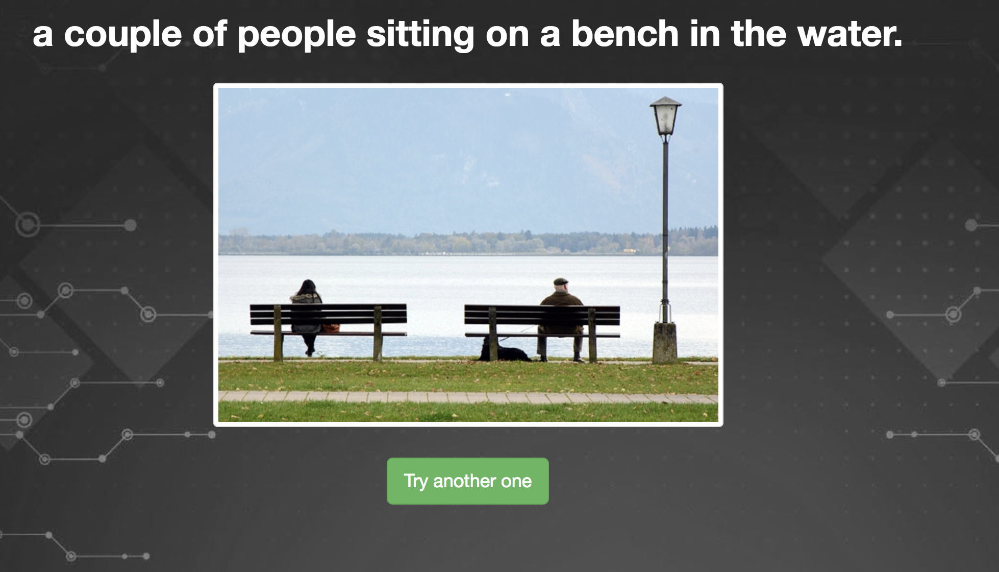
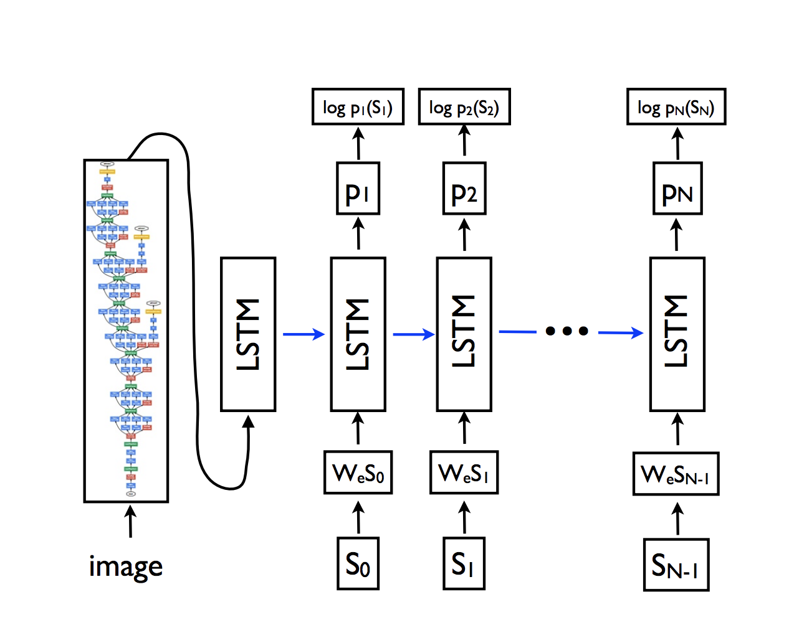

# Image Caption  

## Upload any image and Neural Network will generate caption for it.   You can try it [here](https://egstack.com/index_caption.html)

## Description

NodeJS is wrapped around Pytorch Neural Network.  

Convolutional Neural Network is pretrained Resnet50.  
CNN-RNN encoder-decoder pair  was trained with [COCO dataset](http://cocodataset.org/#home).

 Approximate process of traing is described in this [paper](https://arxiv.org/pdf/1411.4555.pdf)  
 

## **Requirements for installation**
- Node JS, Pytorch, Numpy, PIL.
  

## **Run**
To run the app you just need to install all dependencies and hit 'node server.js'
